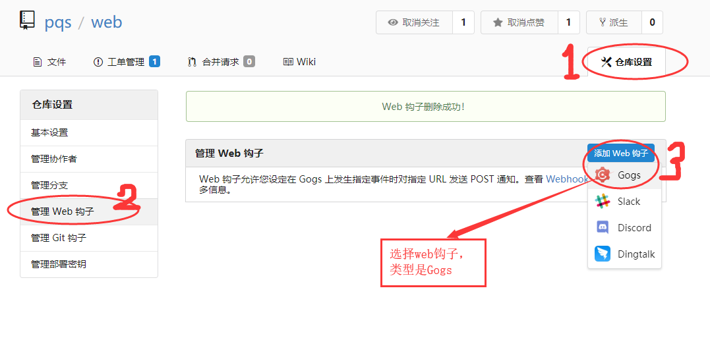
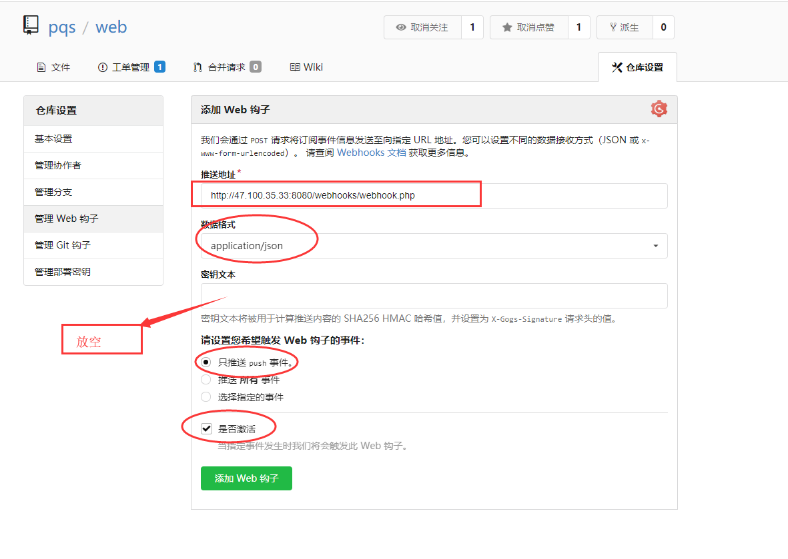
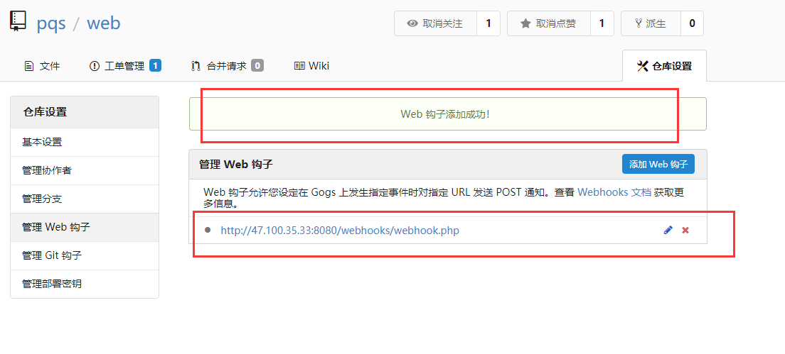
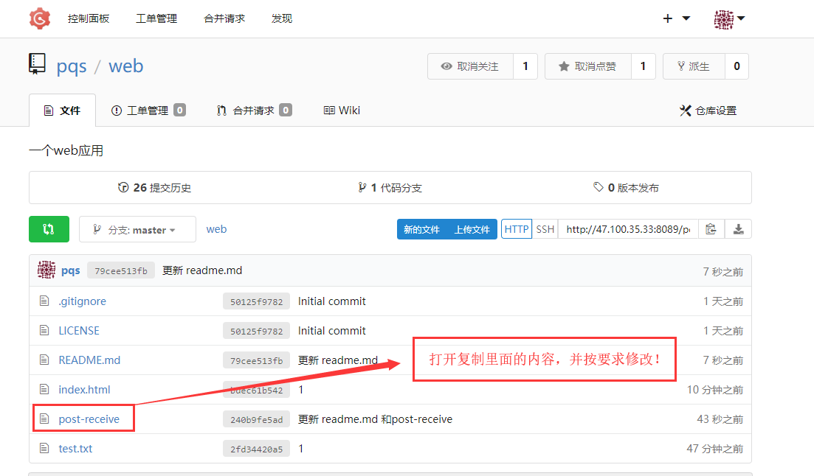
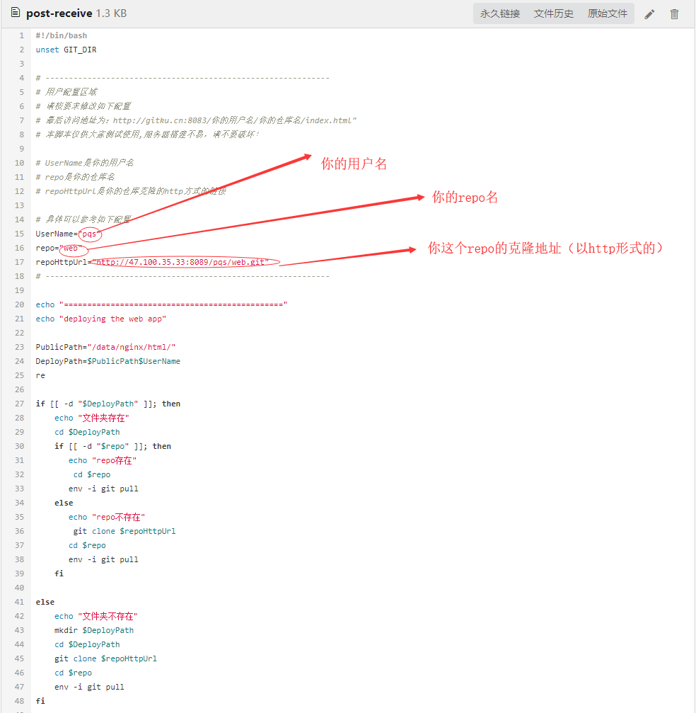
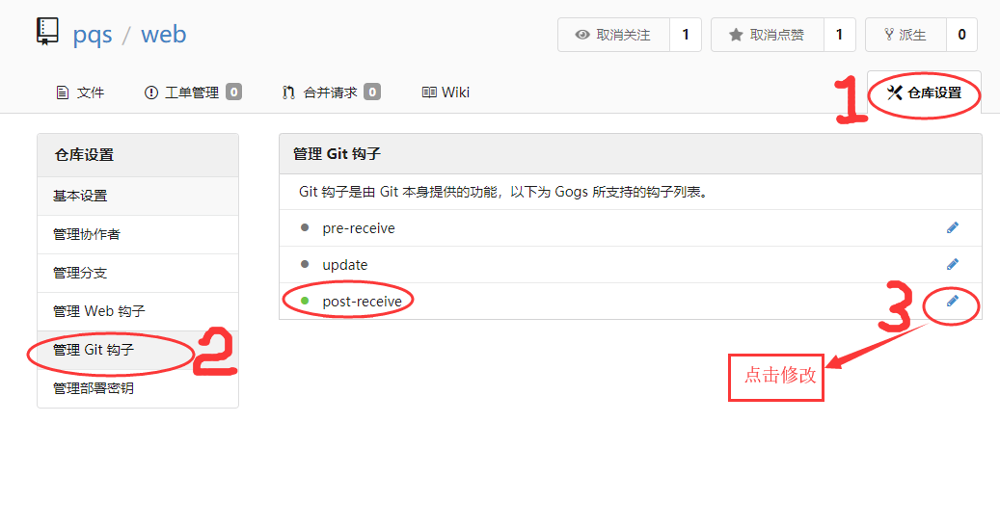
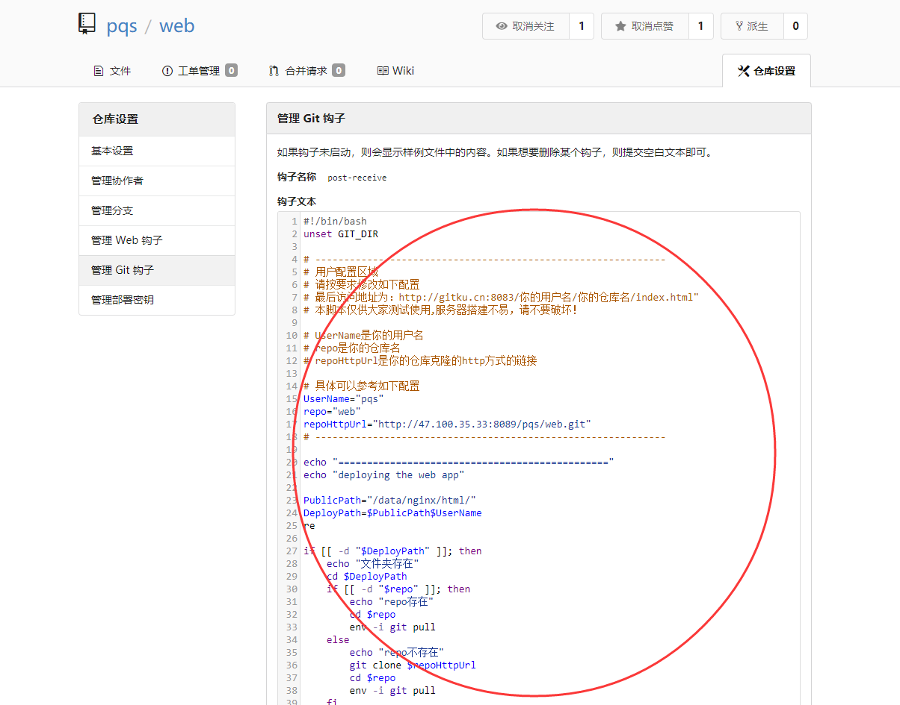
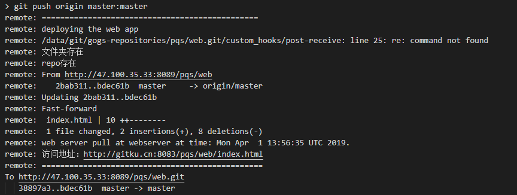

# 一个轻量级 web 应用自动部署的介绍文档

 
 
# 部署方法分为两种（Git 钩子和 Web 钩子）

## 1.Web 钩子方法 [源码](http://www.gitku.cn:8089/pqs/web/src/master/webhooks)

### 这种方法比较简单，不用申请钩子权限,步骤如下

- 1.创建一个 repo
- 2.然后放上你的代码
- 3.仓库设置 => 管理 web 钩子 => 添加 web 钩子（gogs） => 填写推送地址、数据格式、密钥文本（放空）
- 4.推送你的代码, 当你推送完成的时候就会出发 web 钩子去部署你的 web 应用!
- 5.访问地址为：http://gitku.cn:8083/你的用户名/你的仓库名/index.html"

## 图文详情

### 找到你的仓库的 web 钩子设置

### 按照以下要求填写

### 点击添加 web 钩子按钮，完成添加

### 最后修改你的代码，然后当你 git push 到仓库时就会自动触发 web 钩子帮你部署这个 web 应用

### 访问地址为：http://gitku.cn:8083/你的用户名/你的仓库名/index.html"

### 附上推送日志访问地址：http://47.100.35.33:8080/webhooks/git-webhook.txt

## 2.Git 钩子方法

- 1.创建一个 repo
- 2.然后放上你的代码
- 3.向管理员申请 git 钩子,在本的项目中工单管理(issue) 中留下用户名就行
- 4.打开本项目中 post-receive, 复制所有内容
- 5.仓库设置 => 管理 Git 钩子 => 编写 post-receive
- 6.把复制好的内容粘贴到里面, 并且修改用户名，repo，和克隆地址
- 7.推送你的代码, 当你推送完成的时候就会出发 post-receive 钩子去部署你的 web 应用
- 8.访问地址为：http://gitku.cn:8083/你的用户名/你的仓库名/index.html"

# 有图有真相

## 首先打开本项目中的 post-receive 并且复制所有内容

## 要修改的地方如下

## 找到你的仓库的钩子设置

## 粘贴内容并且按照要求（图 2）修改并且更新设置

## 最后修改你的代码，然后当你 git push 到仓库时就会自动触发钩子帮你部署这个 web 应用

## 第一次推送部署成功的 git 的 log 输出应该如下

## 更新推送部署成功的 git 的 log 输出应该如下

## 尽情使用吧！

# 补充说明

- 开源本是不易，请君珍惜！
- 请大家合理使用服务器资源，不要滥用和破坏！谢谢！
- 有任何问题请发邮件给管理员 2945802136@qq.com
